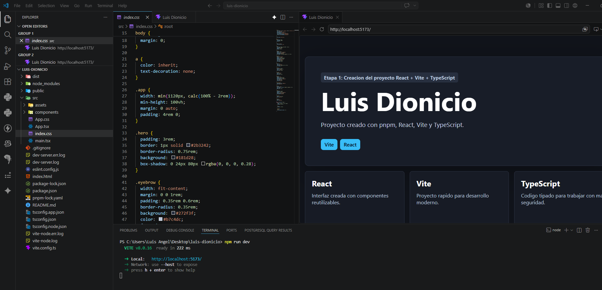
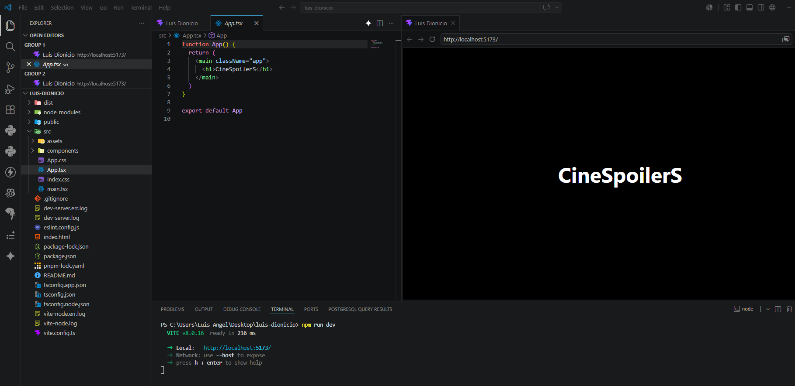
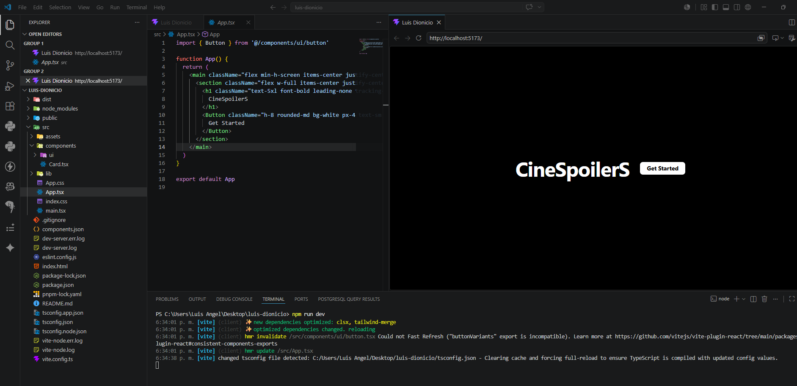
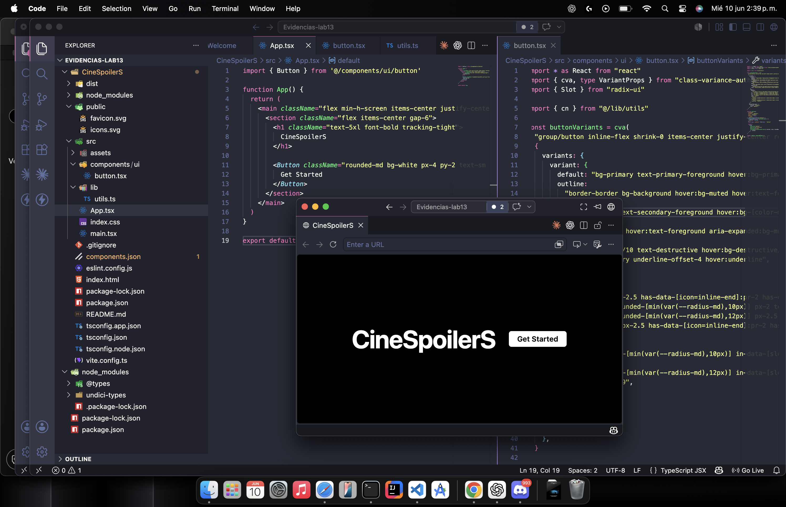
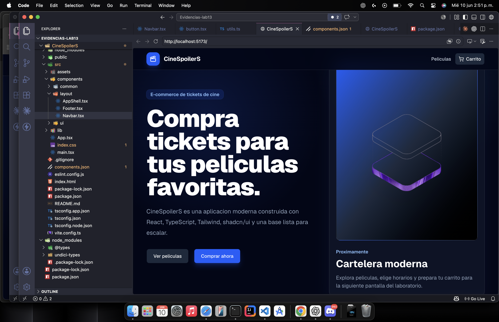
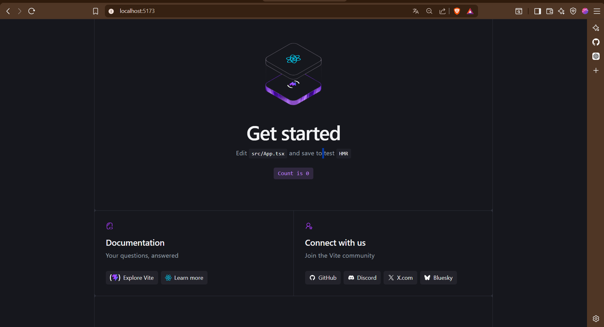
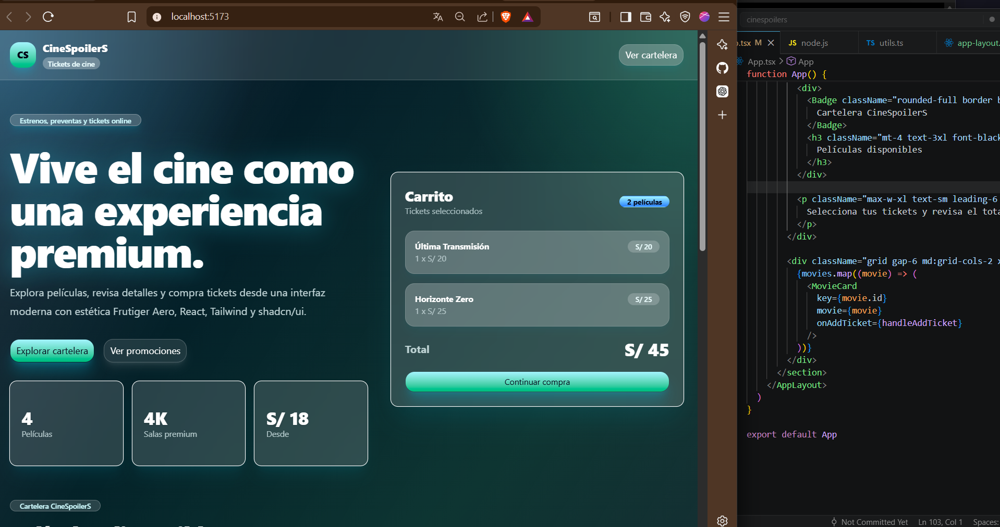

# LAB 13 - LUIS DIONICIO BARTOLO

#### Etapa 1: Creación del proyecto React + Vite + TypeScript

## Etapa 2: Configuración de Tailwind CSS

## Etapa 3: Configuración de shadcn/ui

## Etapa 4: Construcción del layout principal de CineSpoilerS

######

# CineSpoilerS - Lab 13 - Diego Sotelo

## Etapa 1: Creación del proyecto React + Vite + TypeScript

## Etapa 2: Configuración de Tailwind CSS

## Etapa 3: Configuración de shadcn/ui

## Etapa 4: Construcción del layout principal de CineSpoilerS

######

# CineSpoilerS - Lab 13 - Jeronimo Ortiz

## Etapa 1: Creación del proyecto React + Vite + TypeScript

## Etapa 2: Configuración de Tailwind CSS y shadcn/ui

## Etapa 3: Construcción del layout principal de CineSpoilerS

