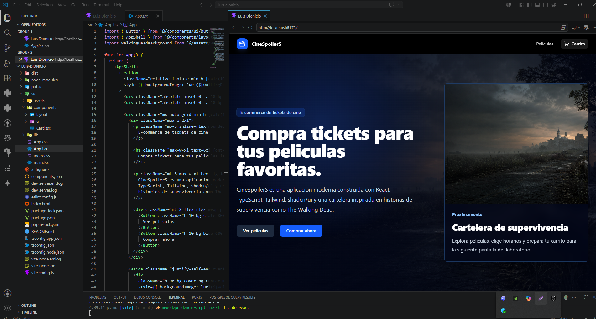

###### LAB 13- LUIS DIONICIO BARTOLO

#### Etapa 1: Creación del proyecto React + Vite + TypeScript

## Etapa 2: Configuración de Tailwind CSS

## Etapa 3: Configuración de shadcn/ui

## Etapa 4: Construcción del layout principal de CineSpoilerS

######
